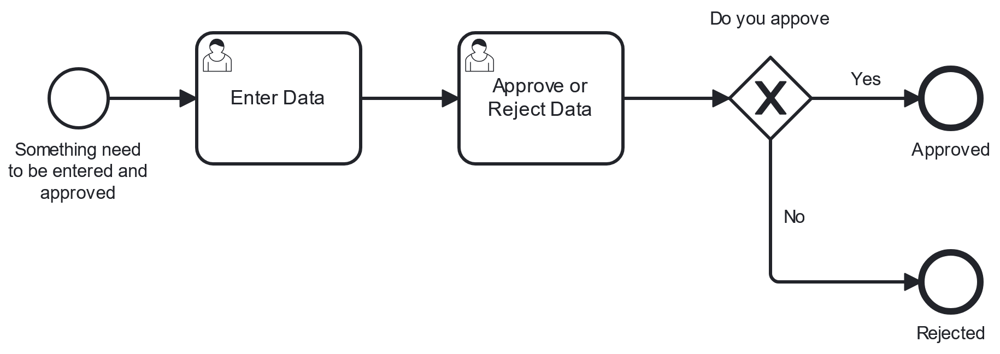

# Simple Approval Example
This is an example of BPMN process which contains a task where data is entered followed by a task where data is approved/rejected

## How to Deploy. 

Create a [Camunda 8 Account](https://signup.camunda.com/accounts). 
Import that contents of the BPMN and Forms folder to the Camunda Web Modeler. 

Follow the instructions to deploying and starting a process here

